### Learning
https://excalidraw.com/#json=oYxujpWrXxGo-NZ0_aeDO,DoXlRnQ85LtXGSAEENW3Cw

### Important Notes
Vectors is just like a numerical representation of text in numbers. so that you can apply techniques like similarity search, cosine similarity . similar kind of result can be retried from the vector database.

Every LLM model have a fixed size for context while embedding the input, so we can put all 100 pages to the context.
Different model may have different context size but its limited. so that's why we divide our data into different chunk adn then we put them into vectors store 
and we fetch only similar data based on search operation.

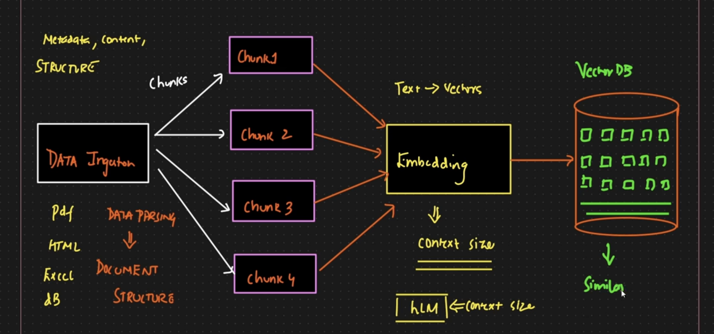

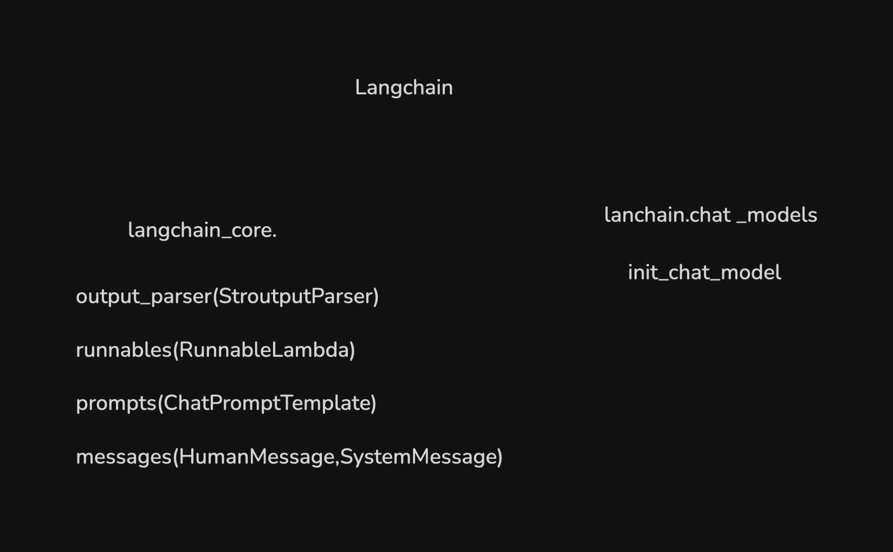

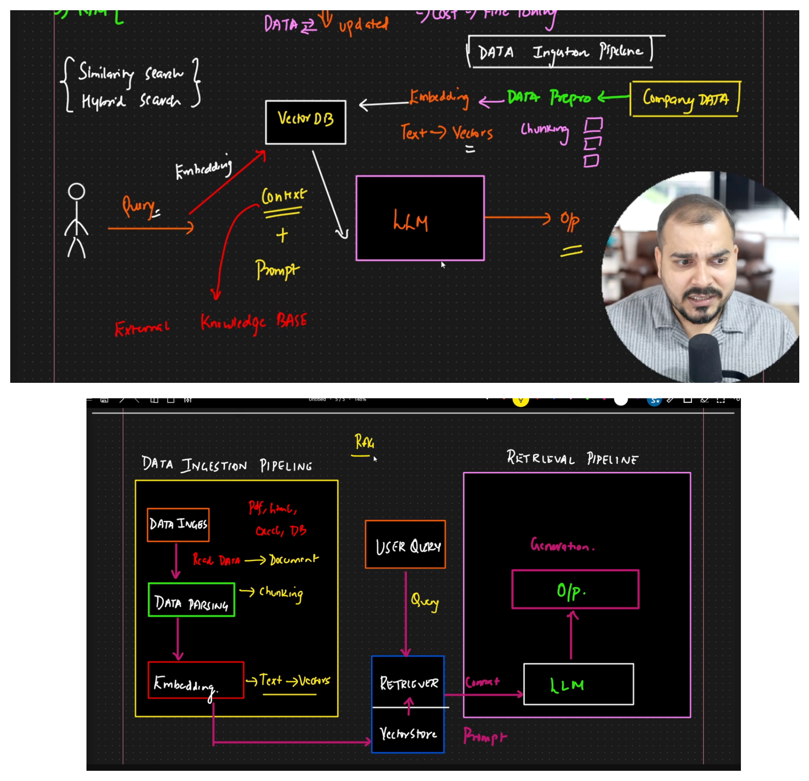

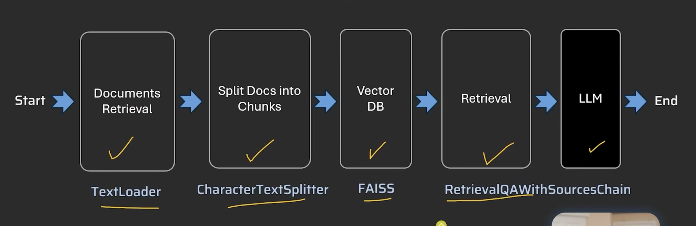

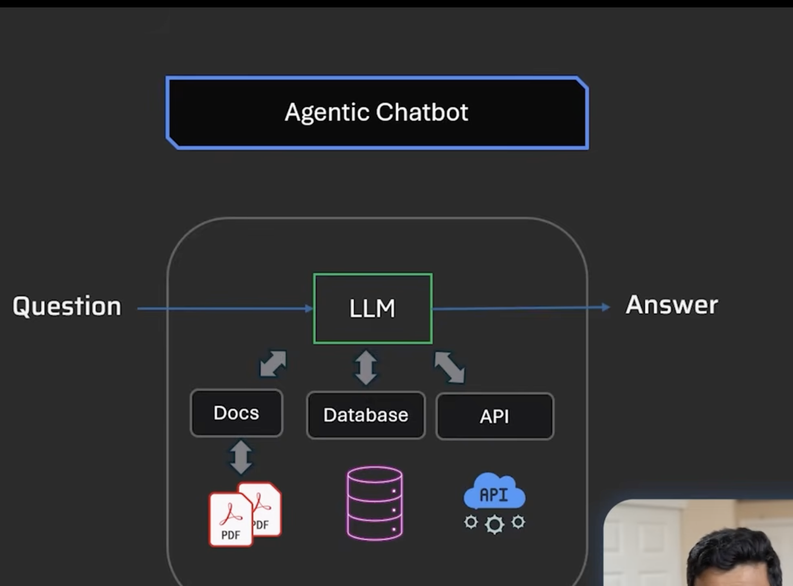

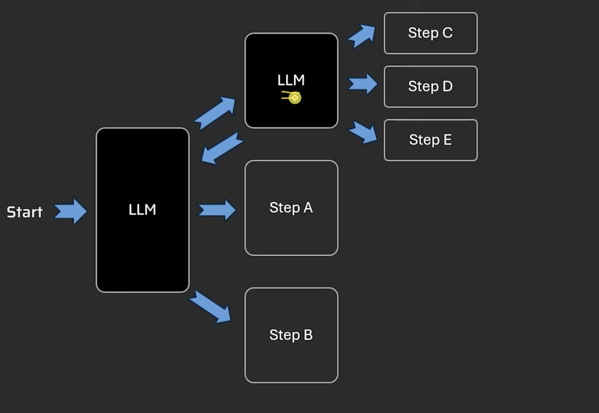

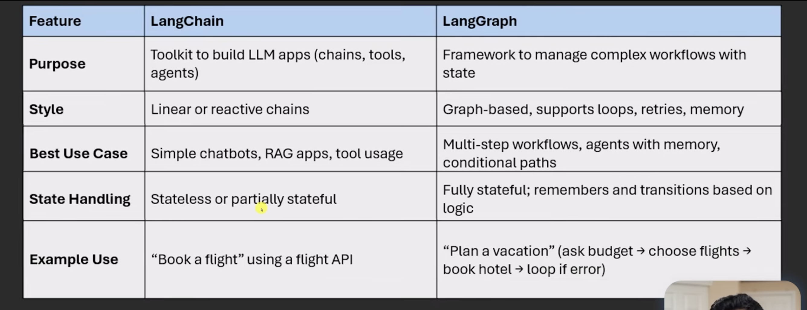

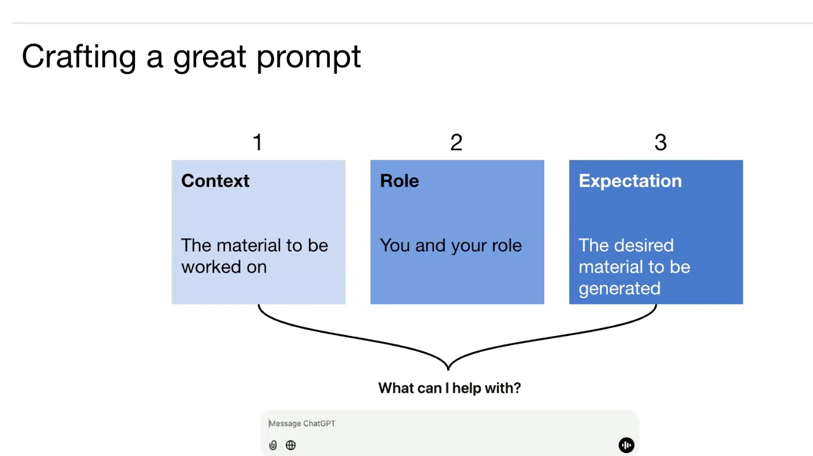

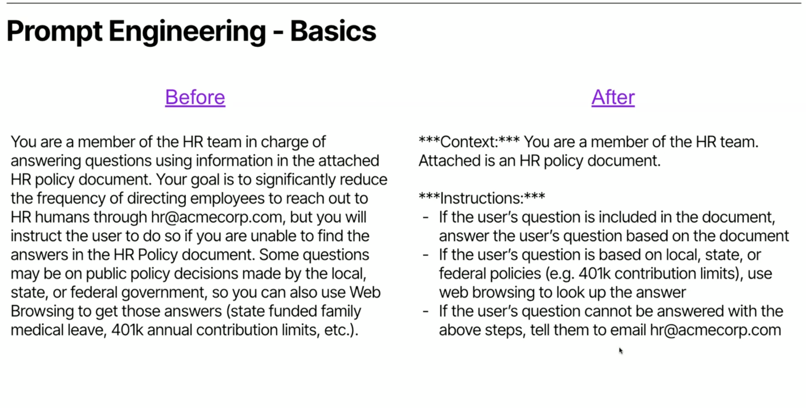

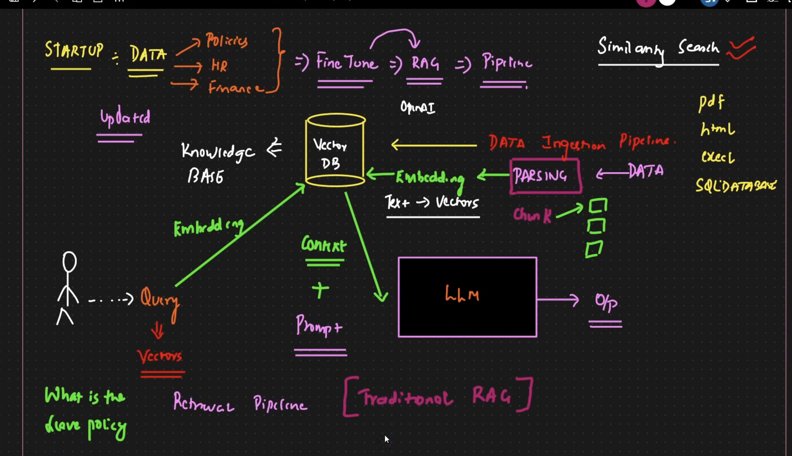

Reinforcement Learning with human feedback (RLHF)

https://www.trychroma.com/?gad_source=1&gad_campaignid=23211005173&gbraid=0AAAABBrV6L9l_6mg1DyJMQ6sAbknqN5U1&gclid=CjwKCAiA86_JBhAIEiwA4i9JuzJiusurYZizpHGZ2-nQI3KIOtT0mypk7QIAq-JXwPDhjoVZqwTnTRoCKfkQAvD_BwE

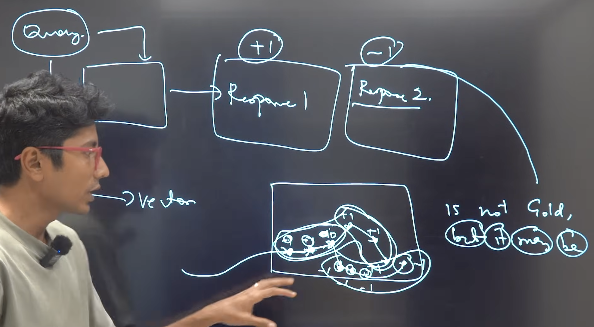

## Python Project setup with virtual env

1. create folder
2. uv init
3. uv venv
4. .venv\Scripts\Activate
5. create requirements.txt ( add depedencies)
6. uv add -r requirements.txt

## Document data structure langchain
https://reference.langchain.com/python/langchain_core/documents/

Document loader converts the document data into langchain document structure

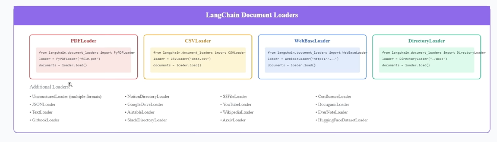
